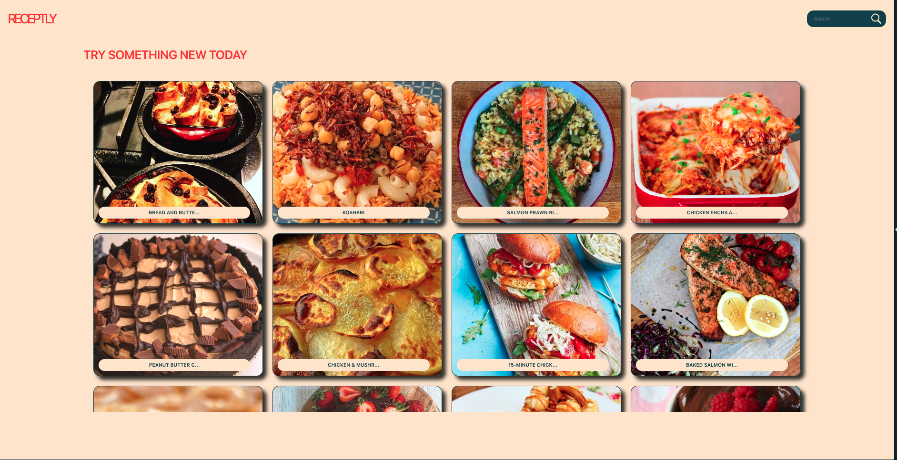
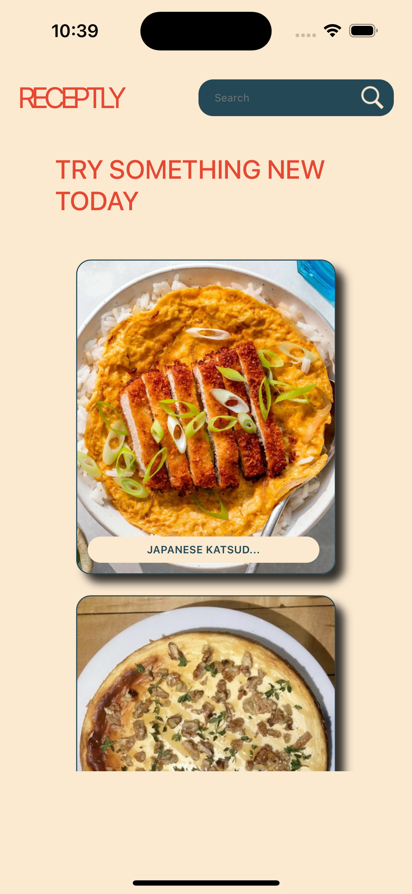
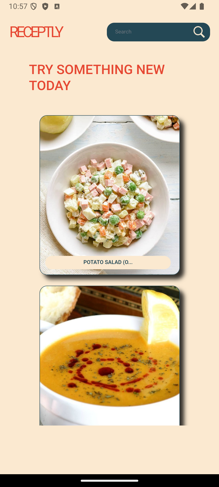

# 🍽️ RECEPTLY

**Receptly** is a cross-platform recipe browsing app built with **Blazor MAUI Hybrid**.  
It delivers a unified experience across **web**, **iOS**, and **Android** platforms, using data from [TheMealDB API](https://www.themealdb.com/).

## 🧠 Project Overview

RecipeHub allows users to explore a wide variety of recipes from around the world, view ingredients, cooking instructions, and meal details in a clean and responsive interface.

The app is structured into three main projects:

- **Recept.App** – The MAUI-based mobile/desktop app
- **Recept.Web** – The Blazor Web App
- **Recept.Shared** – Shared components and logic used across all platforms

## 🍲 Features

- 🔍 Search meals by name or ingredient
- 📖 View detailed recipes with images, ingredients, and preparation steps
- 🌍 Explore meals by region or category
- ❤️ Favorite recipes (local)
- 🧩 Unified UI across devices using Blazor components

## 🛠️ Tech Stack

- **Blazor MAUI Hybrid** (C# + Razor)
- **TheMealDB API**
- **.NET 9**
- Shared logic across platforms via `Shared` project

## 📸 Screenshots

Screenshots of the app running on different platforms are available in the [`screenshots/`](./screenshots) folder.

## 🚀 Platforms

- ✅ Web
- ✅ Android
- ✅ iOS

## 📄 License

This project is open source and available under the [MIT License](LICENSE).
